# SaotomeMangaSDP26

<p align="center">
  
  
  
  
</p>

Proyecto final de la formación Swift Developer Program 25/26 de Apple Coding Academy.

## 🎯 Descripción

**SaotomeMangaSDP26** es una aplicación completa de gestión de mangas que permite a los usuarios:
- 📖 Explorar un catálogo de más de **64,000 mangas**
- 🔍 Buscar y filtrar por múltiples criterios
- 📚 Gestionar su colección personal **local y en la nube**
- 👤 Autenticación segura con sincronización entre dispositivos
- 📱 Experiencia optimizada para **iPhone y iPad**

## 📱 Screenshots

### iPhone

<p align="center">
  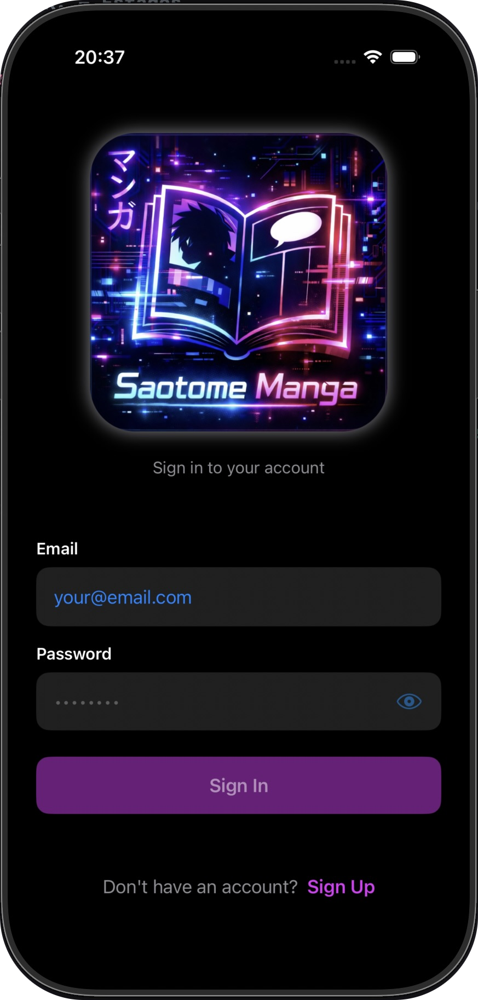
    &nbsp;&nbsp;&nbsp;&nbsp;&nbsp;&nbsp;&nbsp;&nbsp;&nbsp;
  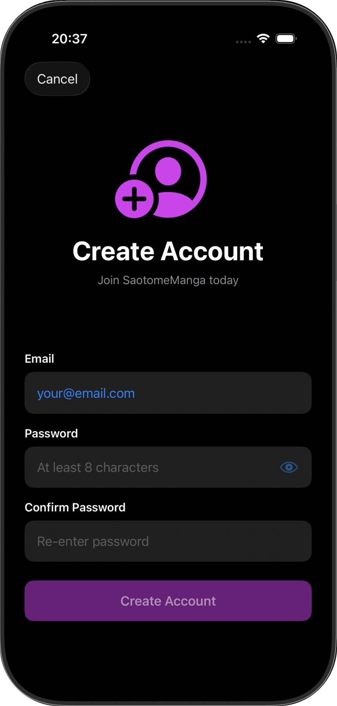
  &nbsp;&nbsp;&nbsp;&nbsp;&nbsp;&nbsp;&nbsp;&nbsp;&nbsp;
  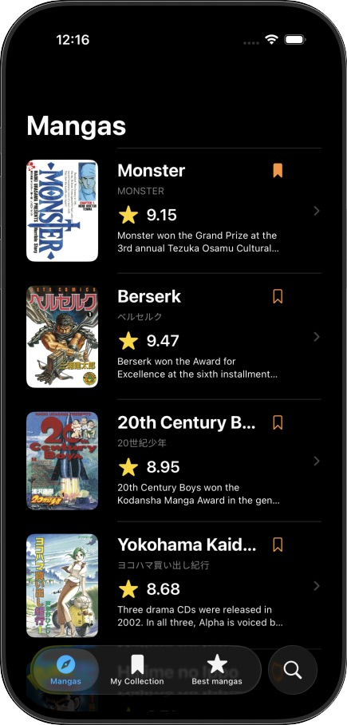
</p>

<p align="center">
  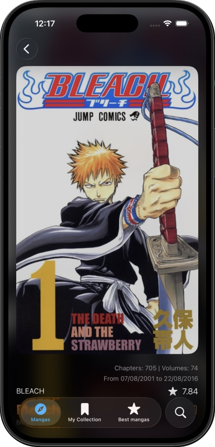
  &nbsp;&nbsp;&nbsp;&nbsp;&nbsp;&nbsp;&nbsp;&nbsp;&nbsp;
  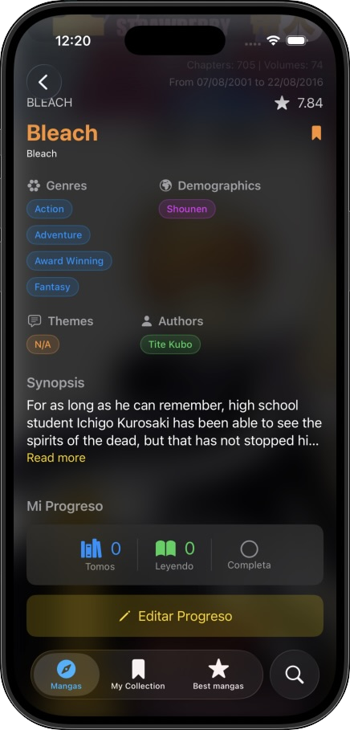
  &nbsp;&nbsp;&nbsp;&nbsp;&nbsp;&nbsp;&nbsp;&nbsp;&nbsp;
   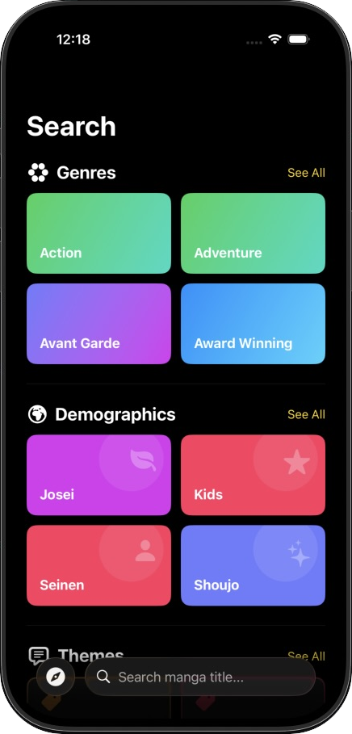
</p>

### iPad

<p align="center">
  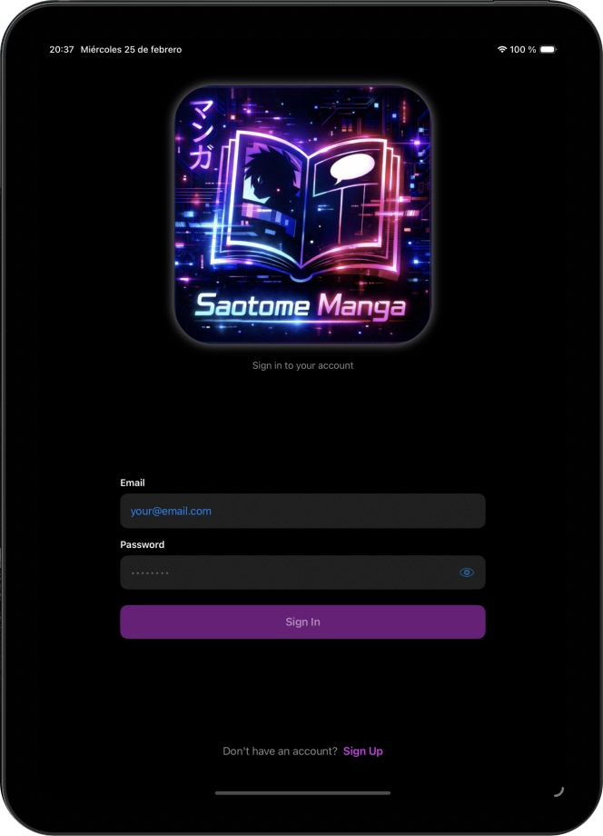
    &nbsp;&nbsp;&nbsp;&nbsp;&nbsp;&nbsp;&nbsp;&nbsp;&nbsp;
  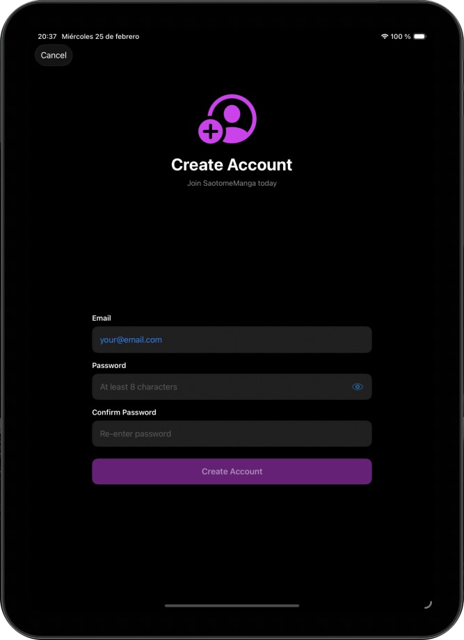
</p>

<p align="center">
  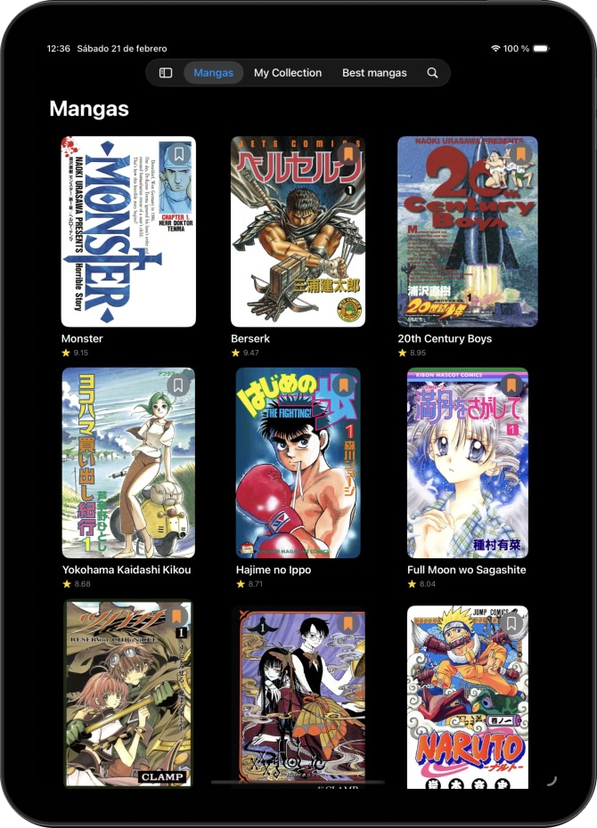
    &nbsp;&nbsp;&nbsp;&nbsp;&nbsp;&nbsp;&nbsp;&nbsp;&nbsp;
  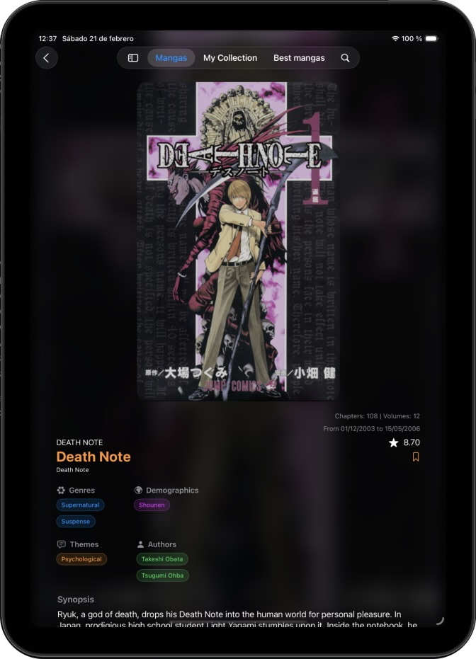
    &nbsp;&nbsp;&nbsp;&nbsp;&nbsp;&nbsp;&nbsp;&nbsp;&nbsp;
  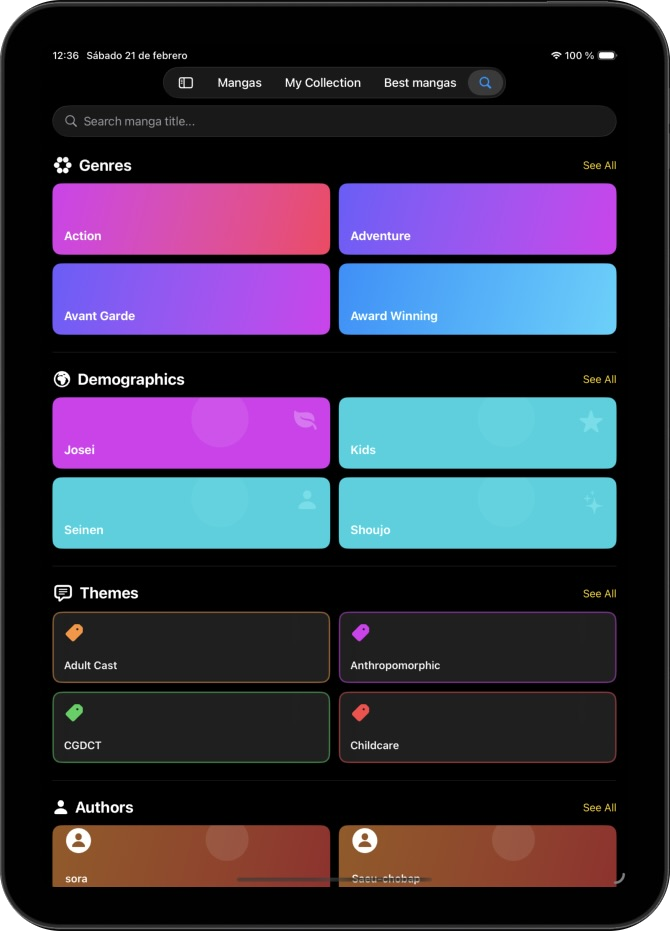
</p>

## ✨ Características Principales

### 🔐 Autenticación y Seguridad
- ✅ **Registro de usuarios** con validación de email y contraseña
- ✅ **Login seguro** con Basic Authentication
- ✅ **Tokens** guardados en Keychain (cartera de certificados)
- ✅ **Renovación automática** de tokens
- ✅ **Sesión persistente** - mantiene la sesión al cerrar/abrir la app
- ✅ **Logout** con limpieza segura de credenciales

### ☁️ Sincronización en la Nube
- ✅ **Colección sincronizada** - tu colección se guarda en la nube
- ✅ **Acceso multi-dispositivo** - misma colección en todos tus dispositivos
- ✅ **Modo híbrido** - funciona offline (SwiftData local) y online (API)
- ✅ **Sincronización automática** al abrir la app
- ✅ **Actualización en tiempo real** - cambios se sincronizan instantáneamente

### 📖 Exploración y Búsqueda
- 🔍 Consulta de más de **64,000 mangas**
- 🔎 Búsqueda por título (coincidencia exacta o contenido)
- 🎯 Filtrado completo por:
  - **Géneros**: Action, Adventure, Romance, Comedy, Sci-Fi, Fantasy, Horror, etc.
  - **Demografías**: Shounen, Shoujo, Seinen, Josei, Kids
  - **Temáticas**: Martial Arts, Super Power, School, Mecha, Vampires, Music, etc.
  - **Autores**: Búsqueda por nombre con autocompletado
- ⭐ Visualización de los **mejores mangas** por puntuación
- 📄 **Paginación inteligente** - carga más resultados al hacer scroll

### 📊 Información Detallada
- 🖼️ Portadas de alta calidad
- 📝 Sinopsis y contexto completo
- ✍️ Autores y su rol (Story, Art, o Story & Art)
- 📅 Fechas de inicio y finalización
- 📚 Número total de volúmenes y capítulos
- ⭐ Puntuación y estado (en curso, finalizado, etc.)
- 🏷️ Géneros, demografías y temáticas con diseño visual distintivo

### 📚 Gestión de Colección Personal
- ➕ **Añadir/eliminar** mangas con un toque
- 📖 **Marcar tomos adquiridos** - lleva el control de tu colección física
- 📍 **Registrar tomo actual** - recuerda por dónde vas leyendo
- ✅ **Colección completa** - marca series completadas
- 💾 **Persistencia dual**:
  - 📱 Local (SwiftData) - funciona sin conexión
  - ☁️ Nube (API REST) - sincroniza entre dispositivos
- 🔄 **Sincronización automática** - cambios se guardan local y remotamente

### 🎨 Diseño Adaptativo
- 📱 **iPhone**: Listas optimizadas con swipe actions
- 📱 **iPad**: Grids de 2-4 columnas según orientación
- 🌓 **Dark Mode** nativo
- 🎭 **Animaciones fluidas** entre vistas
- 🧭 **Navegación intuitiva** con tabs y NavigationStack
- 🎨 **UI personalizada** - cada tipo de filtro con su identidad visual

## 🏗️ Arquitectura Técnica

### Tecnologías Utilizadas
- **Swift 6** - Lenguaje de programación
- **SwiftUI** - Framework de UI declarativa
- **SwiftData** - Persistencia local
- **URLSession** - Networking y consumo de API REST
- **Keychain Services** - Almacenamiento seguro de credenciales

### Patrones de Diseño
- ✅ **MVVM** (Model-View-ViewModel)
- ✅ **Repository Pattern** para networking
- ✅ **DTO Pattern** para mapeo de datos
- ✅ **Singleton** para servicios compartidos (Keychain)
- ✅ **Dependency Injection** con `@Environment`

## 📡 API

La aplicación consume la API alojada en:
```
https://mymanga-acacademy-5607149ebe3d.herokuapp.com/
```

### Endpoints de Mangas
- `GET /list/mangas?page={n}&per={cantidad}` - Listado paginado
- `GET /list/bestMangas?page={n}` - Mejores por puntuación
- `GET /list/mangaByGenre/{genre}?page={n}` - Filtrado por género
- `GET /list/mangaByDemographic/{demographic}?page={n}` - Filtrado por demografía
- `GET /list/mangaByTheme/{theme}?page={n}` - Filtrado por temática
- `GET /list/mangaByAuthor/{authorId}?page={n}` - Filtrado por autor
- `GET /search/mangasContains/{query}?page={n}` - Búsqueda por título
- `GET /search/author/{name}` - Búsqueda de autores

### Endpoints de Autenticación
- `POST /users` - Registro de nuevo usuario
  - Headers: `App-Token: {token}`
  - Body: `{ "email": "...", "password": "..." }`
- `POST /users/login` - Inicio de sesión
  - Headers: `Authorization: Basic {base64(email:password)}`
  - Response: `{ "token": "..." }`
- `POST /users/renew` - Renovar token
  - Headers: `Authorization: Bearer {token}`

### Endpoints de Colección
- `GET /collection/manga` - Obtener colección del usuario
- `POST /collection/manga` - Añadir/actualizar manga en colección
  - Body: `{ "manga": id, "volumesOwned": [1,2,3], "readingVolume": 2, "completeCollection": false }`
- `GET /collection/manga/{id}` - Obtener manga específico
- `DELETE /collection/manga/{id}` - Eliminar de colección

**Autenticación:** Todos los endpoints de colección requieren `Authorization: Bearer {token}`

## 🔒 Seguridad

- ✅ **Keychain** - Credenciales almacenadas en la cartera de certificados del dispositivo
- ✅ **Token-based Auth** - Autenticación mediante tokens JWT
- ✅ **HTTPS** - Todas las comunicaciones cifradas
- ✅ **Token expiration** - Tokens válidos por 2 días con renovación automática
- ✅ **Secure Password** - Validación de contraseñas (mínimo 8 caracteres)

## 📋 Requisitos del Sistema

- **iOS**: 18.0+
- **Xcode**: 16.0+
- **Swift**: 6.0+
- **Dispositivos**: iPhone y iPad

## Instalación
1. Clona el repositorio.
2. Abre `SaotomeMangaSDP26.xcodeproj` o `.xcworkspace`.
3. Ejecuta en un simulador o dispositivo.

## 🧪 Testing

La aplicación incluye:
- ✅ Persistencia local con SwiftData
- ✅ Sincronización con API REST
- ✅ Autenticación completa
- ✅ Manejo de errores de red
- ✅ Estados de carga y vacío
- ✅ Modo offline funcional

## 🎓 Aprendizajes Clave

Este proyecto ha permitido trabajar con:
- ✅ Arquitectura MVVM avanzada
- ✅ Networking con autenticación JWT
- ✅ Persistencia híbrida (local + nube)
- ✅ Keychain para almacenamiento seguro
- ✅ SwiftData para persistencia local
- ✅ Diseño adaptativo iPhone/iPad
- ✅ Gestión de estados asíncronos
- ✅ Manejo de errores robusto
- ✅ UI/UX profesional

## 👨‍💻 Autor

**Manuel Jesús Bermudo Rodríguez**  
Swift Developer Program 25/26 - Apple Coding Academy

## 📄 Licencia

Este proyecto está bajo la licencia MIT.

## 🙏 Agradecimientos

- **Apple Coding Academy** por la formación Swift Developer Program
